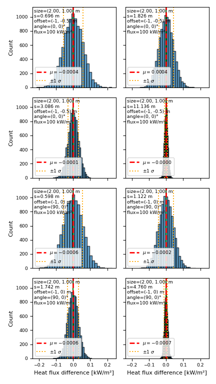

# Radiation Heat Transfer Editor — User Guide

## Overview

This editor supports **radiation heat transfer** calculations using Monte Carlo ray tracing. You define **emitters** (hot surfaces), **receivers** (surfaces that receive radiant flux), and **blocks** (opaque obstacles). The solver computes **net** heat flux on each receiver (incident from emitters plus ambient irradiance when **Ambient temperature** is set, minus receiver re-emission σ·T⁴), so the temperature difference between emitter and receiver is reflected. Only emitters contribute; rays that hit other receivers or blocks do not contribute to that receiver—they only block. Results are shown as heatmaps and can be exported for reporting.

---

## Main concepts

- **Emitter**: A planar surface that radiates heat (e.g. a furnace wall). Set its temperature; the solver uses it to compute emitted power.
- **Receiver**: A planar surface where you want to know the **net heat flux** (e.g. kW/m²). Set its temperature; the solver uses it (net = incident from emitters (plus ambient when set) − σ·T_receiver⁴). Only emitters contribute; rays blocked by other receivers or blocks do not contribute. Each receiver is discretized into a grid of cells; the solver returns one net flux value per cell (raw data). The editor shows a heatmap and optional contour lines.
- **Block**: An opaque object that blocks radiation (no transmission). Used to model obstacles between emitters and receivers.
- **Image plan**: A horizontal plane that displays an imported image (e.g. a floor plan or schematic). You set scale and origin so world units match the image. It is used as a drawing surface for the E2/R2 and E3/R3 two-point tools to create emitters and receivers aligned to the plan.
- **Helper plan**: A horizontal plane with a grid and user-defined dimensions. It serves as a drawing surface (like an image plan) for the E2/R2 and E3/R3 two-point tools when you want to create emitters or receivers on a reference plane without an image.

All geometry uses the **front face** of each object for radiation (emission, reception, or blocking). The front face is the one with the **+Z** normal in the object’s local space. For **receivers**, the sample points (the grid where heat flux is computed) are placed on this **front face**, not at the center of the receiver’s thickness. You should expect this to yield **conservative** results (e.g., higher heat flux) where the model is used for design or safety checks.

---

## Units

All quantities use the following default units (no unit selector in the UI):

- **Length**: metres (m) — positions, dimensions, mesh size, and world coordinates.
- **Temperature**: kelvin (K) — emitter temperature, receiver temperature, and ambient temperature.
- **Heat flux**: kilowatts per square metre (kW/m²) — net heat flux on receivers (solver output, heatmap, and reports).

Ensure your geometry and temperatures are in these units when building the scene.

---

## Workflow

1. **Add objects** (Emitter, Receiver, Block) from the Add menu or left toolbar. You can also create an emitter or receiver **on a plan** with the **E2** / **R2** (flat on plan) or **E3** / **R3** (standing on plan) two-point tools (see below).
2. **Position and scale** them in the viewport. Use the sidebar to set dimensions, temperature (emitters/receivers), and **mesh size** (receivers). In **Settings → Solver** you can set **Ambient temperature** and **Number of Rays**. Ambient temperature sets the environment temperature: when it equals the receiver temperature and there are no emitters, net heat flux is zero; with emitters, net flux is incident from emitters plus ambient minus receiver re-emission. Smaller mesh size = finer receiver grid = more detail but noisier Monte Carlo results.
3. **Run calculation**: Use **Status → Run** (or the Run button). The editor sends scene data to the solver and receives heat flux per receiver.
4. **View results**: Receivers show a heatmap (and optional contour). Hover over a receiver to see **heat flux at cursor**, **min/max range**, and **max flux with location**.
5. **Export**: Use **File → Export → Heat flux report (HTML)** to generate a report (raw data: min, max, max location, receiver width/height per receiver).

---

## Data and display

- **Stored data is always raw**: The values saved in each receiver’s userData (and in the report) are the **raw solver output**. No values are reduced for storage.
- **Noise reduction (display only, experimental)**: In **Settings → Visualization** you can enable **Noise reduction** (e.g. Median floor) to level out dips for a smoother heatmap. This affects **only the displayed heatmap and cursor value**; it never changes stored or reported values. **It is recommended not to apply noise reduction**; this feature is experimental.
- **Visualization refresh**: The heatmap and other result visuals are **only refreshed when you click the Refresh button** under the **Compute** tab (in the sidebar). Changing settings (e.g. color scheme, show/hide results) or re-running the calculation does not automatically redraw the heatmap until you click Refresh.
- **Heatmap texture resolution (upscale)**: The heatmap and contour are drawn at a resolution derived from each receiver’s **mesh size** so that fine grids don’t use excessive memory and coarse grids stay sharp. Mesh size ≤ 0.01 → no upscale (1×); 0.02 → 2×; 0.2 and above → 16×; values in between scale linearly. Texture dimensions are capped at 2048 per side. Different receivers can therefore show slightly different heatmap sharpness if their mesh sizes differ.

---

## Cursor info over a receiver

When you hover over a receiver with results, the tooltip shows:

- **Heat flux** at the cursor position (interpolated; uses display data if noise reduction is on).
- **Position** (world x, y, z).
- **Range** (min–max over the receiver).
- **Max flux** and **location**: the peak heat flux (raw) and where it occurs (world coordinates or cell index). Use this for design checks (e.g. peak heating location).

---

## Reporting

- **File → Export → Heat flux report (HTML)** opens (or downloads) an HTML report with a table of all receivers: name, min, max, max location, units, receiver width, receiver height. All values are **raw solver data**.

---

## Uncertainty: sources and settings

### Sources of uncertainty

Results from the solver are subject to two main uncertainties:

1. **Monte Carlo (statistical) noise**  
   The solver casts a **finite number of rays**. Each cell’s flux is estimated from the rays that hit it. Because the ray directions and outcomes are random, the estimate has **sampling variance**: with more rays, the estimate converges to the true value, but with fewer rays you see random scatter. For typical Monte Carlo estimators, the **standard error** of a cell’s flux scales roughly as **1/√N**, where *N* is the number of rays (or the number of rays that contribute to that cell). So doubling the ray count reduces the typical error by about √2; to halve the error you need about **four times** the rays.

2. **Receiver discretization (mesh size)**  
   The receiver is split into a grid of cells (controlled by **mesh size**). The solver returns **one flux value per cell** (e.g. cell-averaged or cell-centered). Finer mesh (smaller mesh size) gives better **spatial resolution** but **more cells**, so for a fixed total ray count there are **fewer rays per cell** and thus **more noise per cell**. Coarser mesh gives smoother-looking results but less detail.

Other effects (geometry, temperatures, view factors) are deterministic; their “error” is model error, not something you reduce by adding rays or changing mesh size.

### Guidance: mesh size and number of rays

- **Mesh size**  
  - Choose based on the **smallest spatial scale** you care about (e.g. hot spots, gradients). Smaller mesh size = finer grid = more cells.  
  - **Recommended values**: For **larger receivers** (characteristic size greater than 10 units), use a mesh size of **0.5**. For **smaller receivers**, use **0.2**.  
  - Rule of thumb: keep **rays per cell** high enough that the heatmap is usable. If the heatmap is very noisy, either **increase the number of rays** or **increase the mesh size** (fewer, larger cells).

- **Number of rays**  
  - More rays → lower statistical error (standard error ∝ 1/√N).  
  - **Recommended**: Use **500,000** rays to maintain a good level of accuracy (typical errors on the order of 0.05–0.06 kW/m²; worst case in demanding configurations can reach about ±0.2 kW/m² — see Validation results below).  
  - Increase ray count when: you use a **fine mesh** (many cells), you need **smoother spatial variation**, or you want **tighter confidence** on min/max/peak.  
  - There is a trade-off: **finer mesh + more rays** gives both resolution and accuracy but costs more compute.

- **Practical workflow**  
  1. Set mesh size to capture the spatial detail you need.  
  2. Run with a moderate ray count and check the heatmap.  
  3. If results are too noisy, increase the number of rays (and/or coarsen mesh size slightly).  
  4. For final or reportable values, use a ray count that gives acceptably low noise; the **raw** stored and reported values are the Monte Carlo estimates (noise reduction in the editor is display-only).

### Validation results (500k rays, single-point receivers)

Validation runs were performed with **500,000 rays** per run, **1,000 runs** per configuration, for several emitter–receiver geometries (perpendicular and parallel orientations, various separations). Reference (expected) heat flux was computed analytically where available. The following summarizes the observed Monte Carlo error (solver output minus reference, in kW/m²):

- **Bias**: The **mean error** across runs is close to **zero** in all tested cases, so the solver is effectively unbiased.
- **Spread**: The **standard deviation** of the error depends on the configuration. In **high–view-factor** cases (small separation, high expected flux), the standard deviation is on the order of **0.05–0.06 kW/m²**. As the **view factor** (and expected flux) **decreases** (e.g. larger separation), the standard deviation **decreases** and is about **0.01 kW/m²** in the lowest-flux cases tested.
- **Worst-case single-run error**: In the **most demanding** tested configurations (highest view factor), individual run errors can occasionally reach about **±0.2 kW/m²**. When the view factor is smaller (e.g. larger separation), errors are **generally within about 0.1 kW/m²** (and often within ~0.04 kW/m² in the lowest-flux cases).
- **Practical implication**: For **500k rays**, expect typical (one-standard-deviation) errors on the order of **0.05–0.06 kW/m²** in high-flux regions and **smaller** in low-flux regions. To keep worst-case errors within about **0.1 kW/m²** in high–view-factor setups, consider increasing the ray count (e.g. 1M rays) or averaging over multiple runs.

The figures below show the **distribution of errors** (solver output minus reference, in kW/m²) for each separation in the validation set. Each subplot is a histogram over 10,000 runs; the **red dashed line** is the mean error, and the **orange dotted lines** are mean ± 1 standard deviation. Subplots are ordered by separation (smaller to larger, left to right and top to bottom); as separation increases, view factor and expected flux decrease, and the spread of errors narrows.

---

## Calculating heat flux at a single point

To obtain heat flux at one specific location: add a **receiver** at that location, set the receiver dimensions to a **small size** (e.g. 0.1 × 0.1), and set the **mesh size** to be **greater than** the size of the receiver. This produces a single calculation point on the receiver at its center.

---

## Creating an emitter or receiver on a plan (E2 / R2 and E3 / R3)

You can create an **emitter** or **receiver** by drawing a rectangle on a **drawing surface** (an image plan or the default horizontal plane at y = 0). This is useful when you want the object’s corners and orientation to match a plan.

- **E2 / R2**: Creates an emitter or receiver **flat on the plan** (e.g. a floor panel). The two points define the rectangle on the plane; the object is a thin box lying on the surface.
- **E3 / R3**: Creates an emitter or receiver **standing on the plan** (e.g. a vertical wall panel). The two points define the **base edge** (width) on the plane; the object is a vertical box of fixed height (1 unit by default), which you can adjust in the sidebar after creation.

### Where to find it

- **Left toolbar**: buttons **E2** (emitter on plan), **R2** (receiver on plan), **E3** (emitter standing on plan), and **R3** (receiver standing on plan), after the E / R buttons.
- Click **E2**, **R2**, **E3**, or **R3** to enter **surface creation mode** (the button stays highlighted). Click it again, press **Esc**, or select another tool (E, R, B, or the main toolbar tools) to exit.

### Drawing surface

- If the cursor is over an **image plan**, that plan is used (position and orientation match the plan).
- If there is **no image plan** under the cursor (or none in the scene), the **default horizontal plane at y = 0** is used. You can still create emitters/receivers on the “ground” plane without adding an image plan.

### Two-click workflow

1. **First click (anchor)**  
   Click on the drawing surface to set **point A**. The cursor marker and crosshairs stay fixed at that point, and the surface is locked to that plan (or the default plane).

2. **Move**  
   Move the cursor to define the opposite corner. A **green box outline** (wireframe) shows the exact emitter/receiver volume that will be created. The second corner is always projected onto the locked plane, even if the cursor moves over empty space or another object.

3. **Second click (confirm)**  
   Click to set **point B**. The emitter or receiver is created immediately. For **E2/R2**: its corners match the two points, its mid-thickness is on the plan, and its **front face** is oriented toward the camera. For **E3/R3**: the two points define the base edge; the object stands vertically on the plan with default height 1. **Surface creation mode then exits** (the tool button is deselected).

### Behavior

- **Orientation**: When the drawing surface is an **image plan**, the created object’s **rotation matches the image plan** (so rotation parameters align). When using the default plane at y = 0, the object is aligned to that horizontal plane. In both cases, the front face is flipped if needed so it faces the camera (E2/R2) or the box stands upright (E3/R3).
- **Box outline**: While defining the rectangle (after the first click), a green wireframe **box** is shown so you see the full thickness (default 0.01) and orientation of the object that will be created.
- **Exiting**: You can leave surface creation mode at any time by clicking the active tool button (E2, R2, E3, or R3) again, pressing **Esc**, or choosing another tool (E, R, B, or Select/Translate/Rotate/Scale).

---

## Adding multiple emitters/receivers from an image plan (exploration)

A possible **future** extension is to add **several** emitters or receivers at once by drawing multiple lines or segments on an image plan. The **E2 / R2** and **E3 / R3** two-point tools (above) already let you create **one** emitter or receiver per rectangle on a plan. The idea for a future feature:

1. **Select an image plan** and enable a mode such as “Draw emitters” or “Draw receivers”.
2. **Draw one or more lines** on the image (e.g. click start and end points, or digitize a polyline). Each line could define:
   - A **single** emitter/receiver (e.g. one rectangle aligned to the line), or
   - **Multiple** emitters/receivers along the line (e.g. split the line into segments and create one thin emitter/receiver per segment).
3. **Coordinate conversion**: Image-plan geometry is a horizontal plane (XZ) with a known scale and origin (from the import/reset dialog). So image pixel coordinates can be converted to world XZ, and line endpoints to 3D positions and orientations on the plane.
4. **Creation**: For each segment, create an emitter or receiver (same as Add → Emitter/Receiver): thin box, correct size from the segment length and a chosen width (or fixed thickness), rotated so its local +Z faces up. Set default temperature (emitter/receiver) and mesh size (receiver) from editor defaults.

**Implementation outline** (for a future change):

- Extend the existing **E2 / R2**-style mode to support **multiple** rectangles (e.g. “add another” without exiting) or polyline-based segmentation.
- Store **drawn points** in image-plane space; on “Finish” or each segment, create the corresponding emitter/receiver mesh(es) in the scene, parented to the scene (not the image plan) so they remain standard objects.

This would allow fast layout of many emitters or receivers from a floor plan or schematic without placing each one manually.

---

## Tips

- Use **mesh size** on receivers to balance resolution vs. noise: smaller = finer grid, more cells, noisier per cell unless you increase ray count.
- **Contour lines** (Settings → Visualization) show where flux equals a given value; useful for identifying isoflux regions.
- For conservative design, rely on **raw** min/max/peak in the report and in the cursor “Max flux” line; the heatmap can use noise reduction for readability without changing those numbers.
